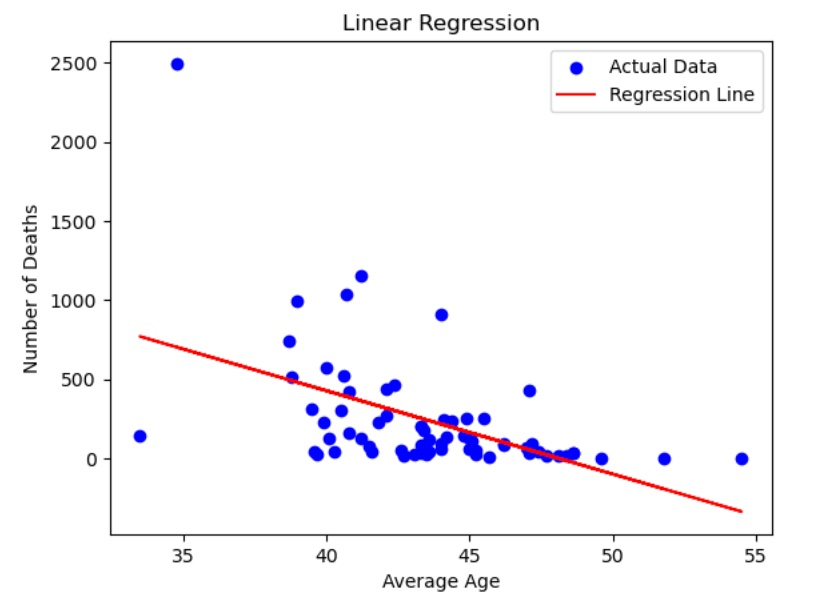

# Project - 1  USING REGRESSION TOOLS TO ANALYSE COVID 19 DATA

Analysing the Impact of Age and Poverty on COVID-19 Deaths

## Description

The COVID-19 pandemic has had a profound impact on the world, and understanding the factors influencing its outcomes is crucial.

In this project, we delve into the world of data analysis to explore the relationship between COVID-19 deaths and two factors: poverty and age.

We're focusing on COVID-19 deaths as our primary measurement. This critical metric directly reflects the impact of the virus on individuals and communities.

The two primary factors of interest are age and poverty. We're interested in how these factors, alone and in interaction, contribute to the variation in COVID-19 death rates.

By conducting a rigorous analysis, we aim to shed light on the complex relationship between demographics, socioeconomic factors, and the pandemic's outcomes.

## Table of Contents

- [Project Overview](#ProjectOverview)
- [Linear Regression](#Linear)
- [T-Tests](#T-Tests)
- [Conclusion](#conclusion)

## ProjectOverview

We're focusing on COVID-19 deaths as our primary measurement. This critical metric directly reflects the impact of the virus on individuals and communities.

The two primary factors of interest are age and poverty. We're interested in how these factors, alone and in interaction, contribute to the variation in COVID-19 death rates.

By conducting a rigorous analysis, we aim to shed light on the complex relationship between demographics, socioeconomic factors, and the pandemic's outcomes.

## Linear Regression

## T-Tests

## Conclusion

T-Tests:  Performed two independent t-tests to compare the average ages of individuals in two groups: those with a poverty rate below a specific threshold and those with a poverty rate above it. Our t-test results revealed a statistically significant difference in average ages between these groups, suggesting that age may be a significant factor influencing COVID-19-related deaths.

Linear Regression with Interaction Effects:  We conducted a multiple linear regression analysis to predict the number of COVID-19-related deaths. The model included 'AGE,' 'POVERTY,' and an interaction term, 'AGE_POVERTY_INTERACTION,' to account for potential combined effects of age and poverty on the outcome. The regression analysis indicated that these variables collectively explain a significant portion of the variance in COVID-19 deaths.

